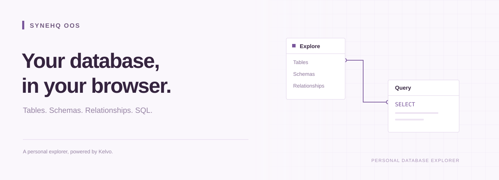
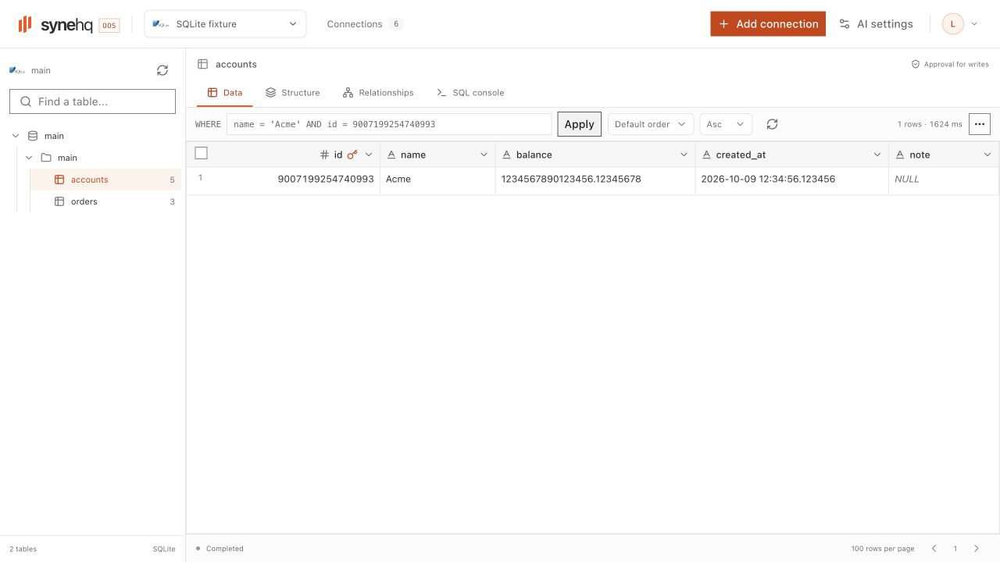
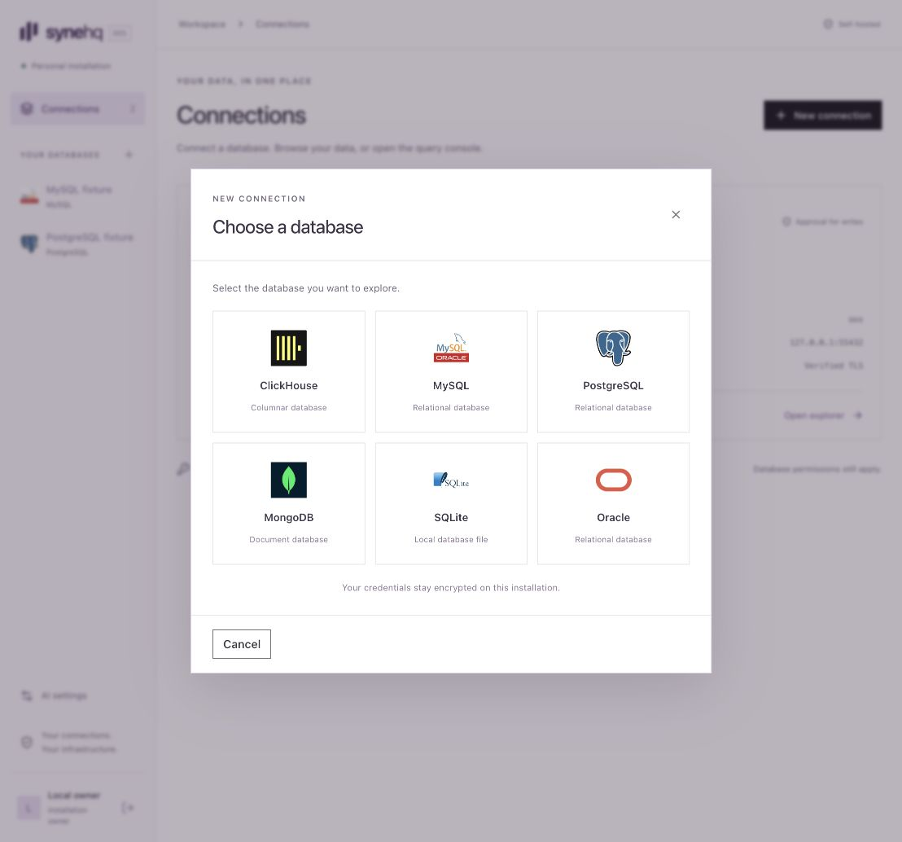
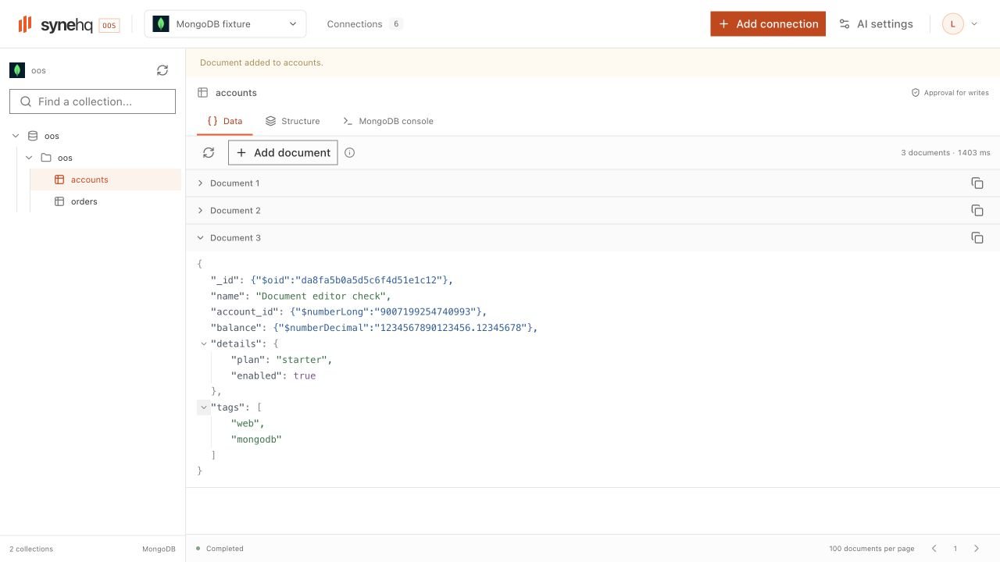
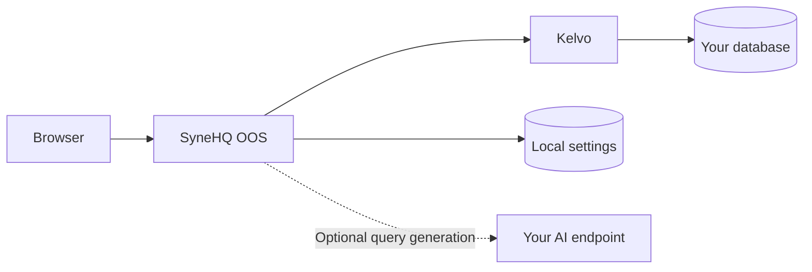

  

  <a href="#what-you-can-do">Features</a> ·
  <a href="#installation">Installation</a> ·
  <a href="#optional-ai">AI</a> ·
  <a href="#how-it-works">Architecture</a> ·
  <a href="#shared-components">Components</a>

# SyneHQ OOS

A personal database explorer. Browse tables and documents, inspect schemas, see relationships, and run queries in your browser.

**Development preview.** The source includes a static dashboard, a small Node API, and Kelvo in one local Docker image. Public release images and maintenance qualification remain incomplete.

The screenshot uses disposable sample data.

## What you can do

| Area                 | Included behavior                                                                                                                           |
| -------------------- | ------------------------------------------------------------------------------------------------------------------------------------------- |
| Connections          | Connect to ClickHouse, MySQL, PostgreSQL, MongoDB, local SQLite, and Oracle. Test the configuration before saving.                          |
| Table browser        | Read rows. Write a SQL WHERE expression, sort the result, and move between pages.                                                           |
| MongoDB documents    | Read stacked JSON documents. Add a document through a JSON editor, then review and approve the insert.                                      |
| Data grid            | Select cells and rows, search the current page, resize columns, and copy or paste values. Integer and decimal strings keep their precision. |
| Row changes          | Edit PostgreSQL and MySQL cells, add rows, and stage selected rows for deletion. Review changes before execution.                           |
| Schema browser       | Inspect columns, data types, nullability, primary keys, and defaults.                                                                       |
| Relationship diagram | Choose one schema to view its tables and declared foreign keys. References to other schemas appear as external nodes.                       |
| Query console        | Use the main SyneHQ Monaco editor. Run selected SQL or a complete MongoDB JSON command, cancel a query, and inspect bounded results.        |
| Result charts        | Plot the current SQL result as a bar, line, or scatter chart. Choose the X and Y columns.                                                   |
| Manual writes        | Enable writes for a connection, then approve the exact query or command and target before each write.                                       |
| Optional AI          | Generate query text with your own endpoint, model, and API key. Review the result before execution.                                         |

Each installation has one owner. Connections start in read-only mode. Database permissions always apply.

The connection picker uses each database's original color logo. Each form shows the fields that its database needs. Read the [database guide](docs/databases.md) for connection steps and engine limits.

Network connections use verified TLS. Local SQLite uses an existing file in a private managed directory. MongoDB results preserve BSON types as Extended JSON.

Selectors use shared Radix controls with the app theme, keyboard navigation, and typeahead.

The table filter accepts the expression after `WHERE`, such as `name = 'Acme' AND balance > 100`. Apply an empty expression to clear it.

MongoDB displays one document per block. Expand nested fields or copy the original JSON. **Add document** appears on write-enabled connections. Each insert requires approval.

The table browser uses grid code extracted from SyneHQ Cloud. Cell edits and row deletions stay local until you select **Review changes**.

Inline row changes require PostgreSQL or MySQL, a write-enabled connection, and a complete primary key. The server checks original row values before it applies a change.

Review lists the target, SQL, and parameter values. Approval applies only to that prepared operation. Conflicts and unknown outcomes stop the remaining changes.

The grid keeps staged changes after a cancelled review. Resolve an interrupted operation before you discard or attempt those changes again.

The current build has no teams, shared workspaces, dashboards, notebooks, or billing. [SyneHQ Cloud](https://synehq.com) provides the wider team product.

The relationship diagram opens on the selected table’s schema. Use its **Schema** selector to view another schema where the engine supports schemas. SQLite shows the current file. Moving nodes does not change the database.

SQL results open as a table. Select **Chart** to plot the returned rows. Chart controls do not execute SQL or fetch more data. MongoDB results use Extended JSON and do not have charts.

The chart reports its row limit and refuses unsafe integer magnitudes. Decimal positions can be approximate. The table keeps exact values.

## Installation

SyneHQ OOS packages the dashboard and [Kelvo](https://github.com/SyneHQ/kelvo-go) in one Docker image. Kelvo provides all customer database access.

The web app stores its own settings in SQLite. It does not require Infisical, Redis, or a Python service.

Read the [single-container guide](docs/container.md) for the image build and Linux host requirements. The runtime uses a Distroless image and serves a static dashboard.

Use a Linux `amd64` or `arm64` host with cgroup v2, Landlock ABI 3 or later, and Docker's systemd cgroup driver. Source builds need Buildx. Initial cgroup setup needs administrator access. Docker Desktop and rootless Docker are not qualified.

For development without Docker, use the [source installation guide](docs/development.md).

Hakopod integration is in progress. Read the [integration plan](docs/hakopod-integration.md) for `/synehq/` builds, access boundaries, and remaining work.

The public installer and release images are not ready. Read the [operations guide](docs/operations.md) for backup, restore, recovery, and key rotation.

The owner setup supports two paths:

1. Create the owner in the browser with a local, time-limited setup token.
2. Disable web setup and create the owner with the local operator command.

Setup closes after the owner account exists. A second account cannot register. Password recovery uses a local command and does not require email.

## Optional AI

The explorer works with AI disabled.

Open **AI settings** to configure an OpenAI-compatible endpoint, model, and optional API key. Include `/v1` in the endpoint URL.

In the query console, select **AI** and describe your query. Schema sharing starts off. Enable it only when you want to send table and column names.

The provider receives your prompt and any schema context you select. The app does not add table rows or database credentials to the request.

Generated query text replaces the editor text. It does not run automatically. Read it, then choose **Run query** for SQL, **Run command** for MongoDB, or **Review write** for a change.

Local HTTP endpoints require an explicit allowlist entry in the host configuration. A provider API key remains optional for endpoints that do not require one.

## How it works

The browser loads static HTML, scripts, and styles. One Node process handles login, settings, approvals, and the private credential resolver. Kelvo connects to customer databases and runs approved operations.

The container has no Next.js server, shell, npm, or TypeScript runner. Static assets are compressed at build time. Database workers start when needed.

Node.js encrypts database hosts, passwords, and provider keys with AES-256-GCM. The installation keeps encryption keys separate from session and service keys.

The signed-in owner can view connection hosts. Ports, database names, usernames, and connection labels remain plain metadata.

An interrupted request can have an unknown outcome. The console shows this state and lets you check the operation. It does not repeat the write automatically.

## Shared components

The explorer uses components extracted from SyneHQ. The reusable packages contain UI and typed data contracts. They do not contain Cloud auth or team logic.

| Package                          | Purpose                                                                      |
| -------------------------------- | ---------------------------------------------------------------------------- |
| `@synehq-oos/ui`                 | Probe buttons, fields, tables, trees, and style tokens.                      |
| `@synehq-oos/explorer`           | Main SyneHQ data grid, Monaco editor, schema tree, and relationship diagram. |
| `@synehq-oos/explorer-contracts` | Connection, schema, target, and query result types.                          |
| `@synehq-oos/charts`             | Standalone Syne Charts module for completed query results.                   |
| `@synehq-oos/kelvo-client`       | Server-side transport to Kelvo.                                              |

SyneHQ Cloud can adopt the UI packages through its own adapters. Cloud integration and public package releases are separate work.

Read the [component boundary](docs/component-sharing.md), [source record](docs/extraction-ui.md), [chart record](docs/chart-provenance.md), and [dependency record](docs/dependencies.md).

## Development status

The current Linux source gate passed 117 tests, TypeScript, and the static production build. The running preview includes the custom dropdowns and editor loading fix.

The r4 container passed live workflows for all six engines. It also passed the default Docker bridge launcher and the full SQLite workflow.

Browser checks covered SQL filters, custom selectors, charts, exact values, and MongoDB document insertion. The approval footer remains visible at a 720-pixel window height.

Backup, restore, key rotation, TLS renewal, source upgrades, and final resource measurements need further checks. Public release images and Cloud adoption remain separate work.

Read the [validation record](docs/validation.md) for revisions, evidence, known issues, and remaining work.

The cover is an illustration. It is not a product screenshot.

## License

SyneHQ OOS uses the [Apache-2.0 license](LICENSE). The standalone chart module uses the [MIT license](packages/charts/LICENSE).

The project owner authorized the SyneHQ component extraction. The [source record](docs/extraction-ui.md) retains its origin and revision.

Dependencies keep their own license terms. Database names and logos belong to their respective owners. The [login photograph](docs/login-visual.md) retains its third-party rights. See [NOTICES](NOTICES) for attribution. Kelvo has its own license and release process.
