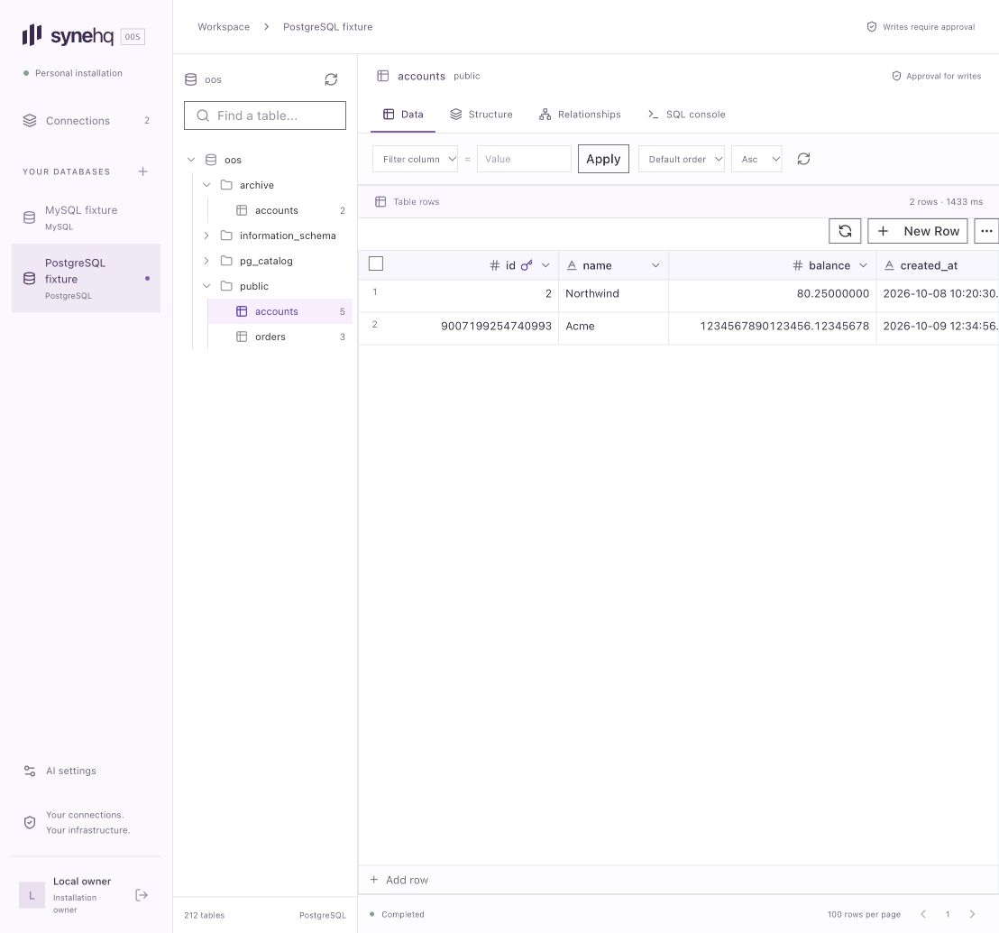

  

  <a href="#what-you-can-do">Features</a> ·
  <a href="#installation">Installation</a> ·
  <a href="#optional-ai">AI</a> ·
  <a href="#how-it-works">Architecture</a> ·
  <a href="#shared-components">Components</a>

# SyneHQ OOS

A personal database explorer. Browse tables, inspect schemas, see relationships, and write SQL in your browser.

**Development preview.** The Linux source runtime is available. Release images, the public installer, and maintenance checks are still in progress.

The screenshot uses disposable sample data.

## What you can do

| Area                 | Included behavior                                                                                                                           |
| -------------------- | ------------------------------------------------------------------------------------------------------------------------------------------- |
| Connections          | Connect to PostgreSQL and MySQL with verified TLS. Add a private CA certificate when required.                                              |
| Table browser        | Read rows, apply an equality filter, choose a sort order, and move between pages.                                                           |
| Data grid            | Select cells and rows, search the current page, resize columns, and copy or paste values. Integer and decimal strings keep their precision. |
| Row changes          | Edit cells, add rows, and stage selected rows for deletion. Review changes before execution.                                                |
| Schema browser       | Inspect columns, data types, nullability, primary keys, and defaults.                                                                       |
| Relationship diagram | Choose one schema to view its tables and declared foreign keys. References to other schemas appear as external nodes.                       |
| SQL console          | Use the main SyneHQ Monaco editor, schema completion, and SQL snippets. Run selected text, cancel a query, and inspect bounded results.     |
| Result charts        | Plot the current query result as a bar, line, or scatter chart. Choose the X and Y columns.                                                 |
| Manual writes        | Enable writes for a connection, then approve the exact SQL and target before each write.                                                    |
| Optional AI          | Generate SQL with your own endpoint, model, and API key. Review the SQL before execution.                                                   |

Each installation has one owner. Connections start in read-only mode. Database permissions always apply.

The table browser uses grid code extracted from SyneHQ Cloud. Cell edits and row deletions stay local until you select **Review changes**.

Row changes require a write-enabled connection and a complete primary key. The server checks original row values before it applies a change.

Review lists the target, SQL, and parameter values. Approval applies only to that prepared operation. Conflicts and unknown outcomes stop the remaining changes.

The grid keeps staged changes after a cancelled review. Resolve an interrupted operation before you discard or attempt those changes again.

The current build has no teams, shared workspaces, dashboards, notebooks, or billing. [SyneHQ Cloud](https://synehq.com) provides the wider team product.

The relationship diagram opens on the selected table’s schema. Use its **Schema** selector to view another schema. Moving nodes does not change the database.

Results open as a table. Select **Chart** to plot the returned rows. Chart controls do not execute SQL or fetch more data.

The chart reports its row limit and refuses unsafe integer magnitudes. Decimal positions can be approximate. The table keeps exact values.

## Installation

SyneHQ OOS requires the web app and [Kelvo](https://github.com/SyneHQ/kelvo-go). Kelvo provides all customer database access.

The web app stores its own settings in SQLite. It does not require Infisical, Redis, or a Python service.

The Linux source runtime is available. Follow the [source installation guide](docs/development.md) for setup and service commands.

The public installer and release images are not ready. Read the [operations guide](docs/operations.md) for backup, restore, recovery, and key rotation.

The owner setup supports two paths:

1. Create the owner in the browser with a local, time-limited setup token.
2. Disable web setup and create the owner with the local operator command.

Setup closes after the owner account exists. A second account cannot register. Password recovery uses a local command and does not require email.

## Optional AI

The explorer works with AI disabled.

Open **AI settings** to configure an OpenAI-compatible endpoint, model, and optional API key. Include `/v1` in the endpoint URL.

In the SQL console, select **AI** and describe your query. Schema sharing starts off. Enable it only when you want to send table and column names.

The provider receives your prompt and any schema context you select. The app does not add table rows or database credentials to the request.

Generated SQL replaces the editor text. It does not run automatically. Read the SQL, then choose **Run query** or **Review write**.

Local HTTP endpoints require an explicit allowlist entry in the host configuration. A provider API key remains optional for endpoints that do not require one.

## How it works

The web app handles owner login, settings, and approvals. Kelvo connects to customer databases and runs approved operations.

Node.js encrypts database credentials and provider keys with AES-256-GCM. The installation keeps encryption keys separate from session and service keys.

An interrupted request can have an unknown outcome. The console shows this state and lets you check the operation. It does not repeat the write automatically.

## Shared components

The explorer uses components extracted from SyneHQ. The reusable packages contain UI and typed data contracts. They do not contain Cloud auth or team logic.

| Package                          | Purpose                                                                      |
| -------------------------------- | ---------------------------------------------------------------------------- |
| `@synehq-oos/ui`                 | Probe buttons, fields, tables, trees, and style tokens.                      |
| `@synehq-oos/explorer`           | Main SyneHQ data grid, Monaco editor, schema tree, and relationship diagram. |
| `@synehq-oos/explorer-contracts` | Connection, schema, target, and query result types.                          |
| `@synehq-oos/charts`             | Standalone Syne Charts module for completed query results.                   |
| `@synehq-oos/kelvo-client`       | Server-side transport to Kelvo.                                              |

SyneHQ Cloud can adopt the UI packages through its own adapters. Cloud integration and public package releases are separate work.

Read the [component boundary](docs/component-sharing.md), [source record](docs/extraction-ui.md), [chart record](docs/chart-provenance.md), and [dependency record](docs/dependencies.md).

## Development status

The repository contains the extracted Cloud grid and editor, owner setup, credential storage, query APIs, row approvals, and optional AI integration.

The final Linux gate passed 58 unit tests, the direct TypeScript check, Prettier, and a production build.

Live explorer and row lifecycle suites passed against PostgreSQL `16.15` and MySQL `8.4.11` using disposable fixtures.

Browser checks covered exact values, cell edits, cancelled review, discarded changes, added rows, and deletion with the original primary key. Table structure, schema selection, selected SQL execution, and all three chart types also passed.

Native row copy, cut, exact decimal paste, and copying after an empty-result reload passed in the browser.

Backup, restore, key rotation, TLS renewal, and source upgrades still need maintenance checks. Public release packaging and Cloud adoption remain separate work.

Read the [validation record](docs/validation.md) for source revisions, binary hashes, completed checks, and remaining work.

The cover is an illustration. It is not a product screenshot.

## License

SyneHQ OOS uses the [Apache-2.0 license](LICENSE). The standalone chart module uses the [MIT license](packages/charts/LICENSE).

The project owner authorized the SyneHQ component extraction. The [source record](docs/extraction-ui.md) retains its origin and revision.

Dependencies keep their own license terms. See [NOTICES](NOTICES) for attribution. Kelvo has its own license and release process.
